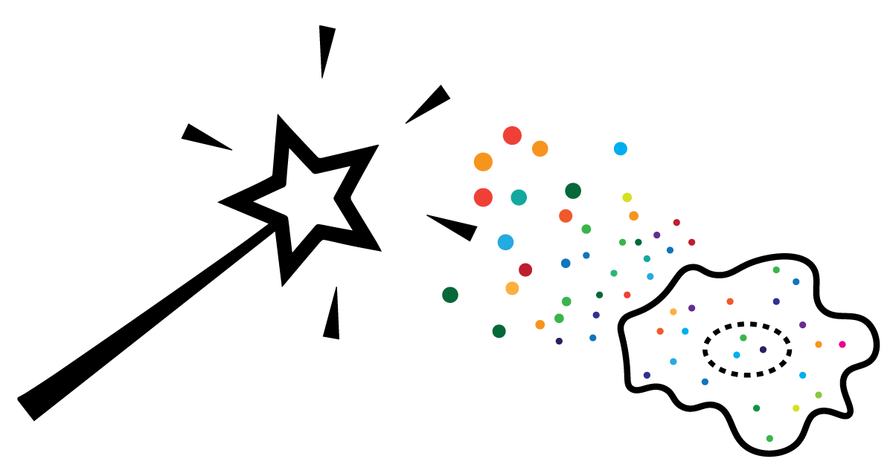

# MERlin - Extensible pipeline for scalable data analysis

MERlin is an extensible data analysis pipeline for reproducible and scalable analysis of large 
datasets. Each MERlin workflow consists of a set of analysis tasks, each of which can be run as 
single task or split among many subtasks that can be executed in parallel. MERlin is able to 
execute workflows on a single computer, on a high performance cluster, or on the cloud 
(AWS and Google Cloud).

If MERlin is useful for your research, consider citing:
Emanuel, G., Eichhorn, S. W., Zhuang, X. 2020, MERlin - scalable and extensible MERFISH analysis software, v0.1.6, Zenodo, doi:10.5281/zenodo.3758540 

Please find the most recent version of MERlin [here](https://github.com/emanuega/merlin).

## MERFISH data analysis

MERlin was originally created for decoding MERFISH datasets. 
[MERFISH](https://science.sciencemag.org/lookup/doi/10.1126/science.aaa6090) is a technology for 
spatially resolved RNA profiling of 10s to 10,000s of RNA species in individual cells 
with high accuracy and high detection efficiency. The standard MERlin MERFISH analysis
workflow decodes and segments MERFISH datasets to determine RNA molecules and the 
cell boundaries represented in the raw images. 

## Documentation

For more information on installation and usage, please see the [documentation](https://emanuega.github.io/MERlin/).

## Authors

* [**George Emanuel**](mailto:emanuega0@gmail.com) - *Initial work* 
* **Stephen Eichhorn**
* **Leonardo Sepulveda**

Contributions are welcome! Please see the 
[documentation](https://emanuega.github.io/MERlin/contributing.html) for contribution guidelines.

